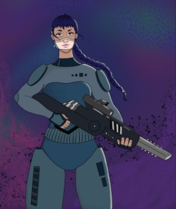

# Aalya Kothe

Aayla Kothe era de uma família de criminosos, capturados e executados a mando do Comando Estelar, deixando apenas a menina para trás em uma casa em ruínas. A facção dos Mandalorians foi atrás de um tesouro em seu planeta natal quando encontraram a órfã sozinha nos escombros e a acolheram como parte do grupo, sem saber os detalhes sobre sua família. Aayla possui uma personalidade rebelde, seguindo as regras dos Caçadores de Recompensa apenas quando estão alinhadas com seus interesses pessoais, mas aprendeu a se importar de verdade com os demais membros da facção que a escolheu.

Após ser acolhida pelos Mandalorianos, Aayla passou por um período turbulento de adaptação à nova vida. Aos poucos, ela começou a demonstrar uma habilidade natural para a vida nas margens da sociedade galáctica. Sua destreza física e mental logo a destacou entre os demais membros da facção, conquistando o respeito de seus companheiros. Enquanto crescia entre os Mandalorianos, Aayla se tornou uma verdadeira mestra na arte do combate, treinando incansavelmente com todas as armas e técnicas disponíveis para ela. Sua destreza com um blaster ou uma lâmina era impressionante, e ela logo se tornou uma das principais combatentes da facção.