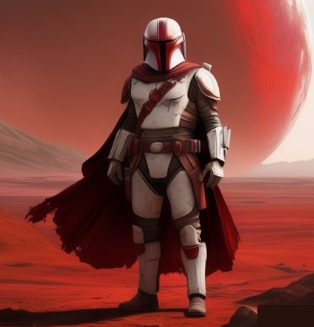

# Kael Wren

Kael Wren é um guerreiro cuja vida foi moldada pela tragédia e pela busca por vingança. Criado nas vastas planícies do planeta zyne, Kael nasceu em uma família de guerreiros respeitados que defendiam ferozmente a família real de seu planeta

Determinado a seguir os passos de seus pais, Kael mergulhou na tradição guerreira de zyne desde tenra idade, treinando nas artes do combate e da estratégia sob a tutela de mentores habilidosos, além de aprender devoção inabalável à honra e ao dever.

No entanto, a vida de Kael mudou para sempre quando seu planeta sofreu uma invasão do conglomerado Slitherium que buscava os minérios valiosos de Zyne. Na invasão sua família e muitos amigos morreram, e Kael mal sobreviveu ao ataque. Logo, determinado a vingar seus companheiros caídos, Kael partiu em uma jornada solitária pela galáxia.

Tornando-se um caçador de recompensas, Kael percorreu os confins da galáxia e inevitavelmente ele enfrentou desafios mortais e fez inimigos poderosos, mas sua determinação nunca vacilou. Ao longo do caminho, ele conhece um grupo chamdo The mandalorians que possuia interesses similares. Vendo que o grupo tinha honra e lealdade kael encontrou aliados poderosos para seguir a sua