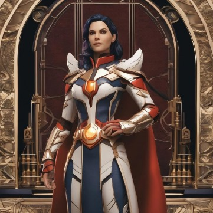

# Kira Quinn

Kira Quinn veio ao mundo em um planeta distante, onde sua família era venerada como uma antiga linhagem de guardiões. Cresceu imersa nas tradições de honra e coragem, transmitidas de geração em geração. Mas a tranquilidade de sua vida foi abruptamente interrompida durante uma batalha feroz contra as forças do Império Galáctico. Nesse confronto devastador, seus pais foram capturados e cruelmente executados, deixando Kira órfã ainda na infância. Mas o destino lhe reservava uma nova jornada quando os Mandalorians, liderados por um renomado caçador de recompensas, visitaram seu planeta em busca de aliados e recursos.

Foi nesse momento que Kira chamou a atenção desse líder Mandalorian, que a acolheu em sua facção. Ela se tornou uma guerreira destemida e habilidosa, absorvendo os valores de honra e lealdade que caracterizavam os Mandalorians. Assim, Kira se tornou uma caçadora de recompensas talentosa, sempre em busca de novos desafios e recompensas.