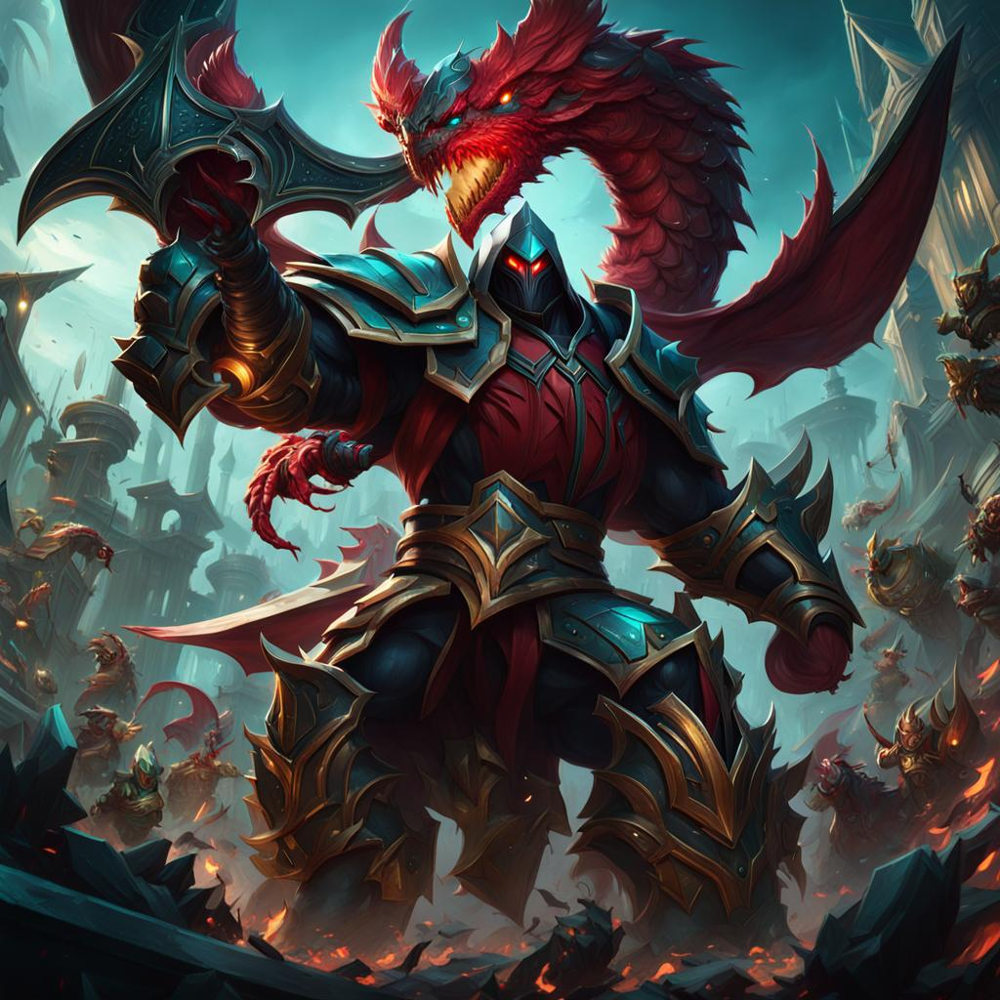

# Pyke

Natural do planeta Vitarus, Tenra Lunarus viu sua família ser assassinada à sangue frio por Atrium, capitão da empresa militar privada Celestia. Movido por uma sede de vingança insaciável, a Entidade Pyke tomou seu corpo por completo, transformando-o em um infame caçador de recompensas que buscava seu maior troféu: A cabeça de Atrium.

Até que, no ano de 3250, ao Slitheruim contratar Celestia para comandar um importante ataque à um mina de granito absoluto em Vitarus, Pyke obteve sua oportunidade de vingança, eliminando o esquadrão militar e decapitando Atrium.

Assim que o Comandante Estelar teve conhecimento das habilidades de Pyke, este o auxiliou a fundar sua facção de caçadores de recompensas, denominada The Mandalorians, com o intuito de obter serviços da poderosa Entidade que habitava o corpo de Tenra Lunarus.

Nas ravinas do planeta árido, entre pilares e escadarias de granito absoluto, The Mandalorians observam a força e disciplina de seu líder, ao manter constantemente em seu lado, a lembrança de um passado obscuro.