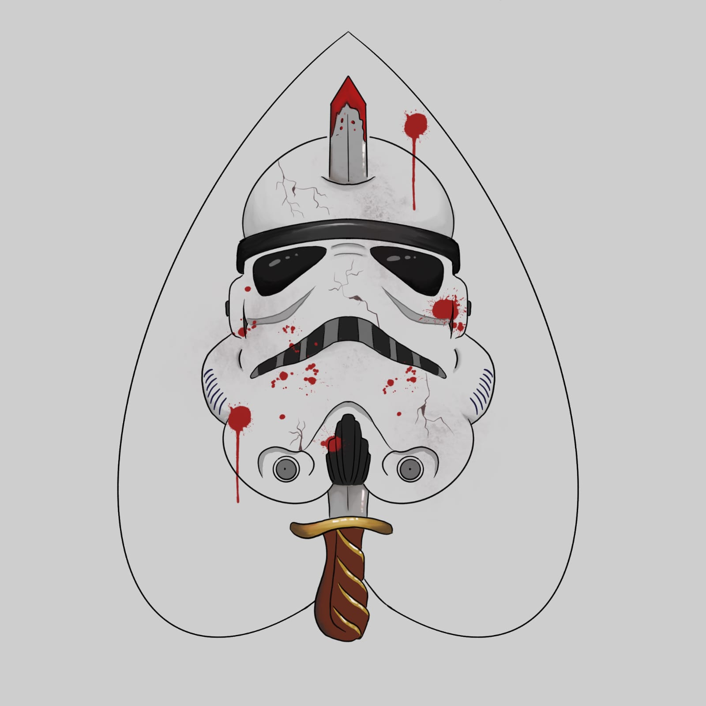

# Facção The Mandalorians

Seja bem vindo(a) ao repositório de documentação do projeto HomeTasker!

Documentação destinada para o projeto realizado para a disciplina de Requisitos de Software (FGA0172), ministrada no curso de Engenharia de Software da Universidade de Brasília Campus Gama.

## Integrantes 
| Integrantes     | Personagem      |           Nome | GitHub |  
| --------------- | --------------- | -------------- | ------ |
| |      Pyke       |  Lucas Bottino  |  [bottinolucas](https://github.com/bottinolucas)              |
| |      Blizel     |  Felipe Araujo  | [lipeearaujo](https://github.com/lipeaaraujo)               |
| |    Aayla Kothe  |  Cecília Quaresma | [cqcoding](https://github.com/cqcoding)               |
| |    Kira         | Raquel Andrade  | [raquel-andrade](https://github.com/raquel-andrade)                |
| |     Zephyr      |  Julio Roberto  |  [JulioR2022](https://github.com/JulioR2022)               |
| |     Kael Wren   | Guilherme Dutra |  [GuiDutra21](https://github.com/GuiDutra21)               |
| |     Byte        | Caio Falcão     |   [CaioHabibe](https://github.com/CaioHabibe)              |