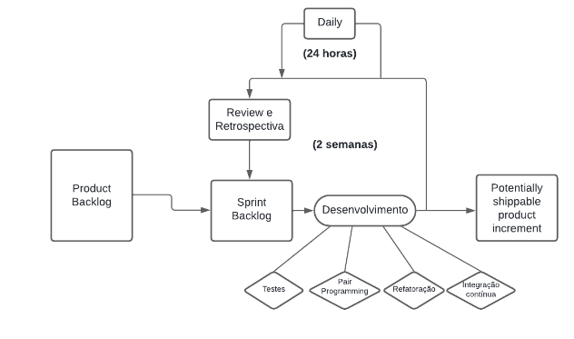

# Processo de Desenvolvimento de Software

O foco será trabalhar com a metodologia ágil, uma vez que a disciplina exige 4 entregas ao longo do semestre, nas quais será preciso planejar, avaliar os requisitos, consultar o cliente real, desenvolver o produto de software, além de realizar testes e ajustes ao longo do tempo. Desse modo, a metodologia ágil é a que melhor se adequa às necessidades do projeto, uma vez que permite planejamento semanal, agilidade nas entregas e maior adaptabilidade.

O processo a ser utilizado é o Scrum XP, que combina o framework SCRUM para organizar as tarefas, promover a transparência no projeto e a adaptação a mudanças. Já o XP (Extreme Programming) apresenta as práticas para desenvolver o software, como a programação em pares, o desenvolvimento voltado a testes (TDD), integração contínua, refatoração do código e maior comunicação com o cliente.

O ciclo de vida será iterativo e incremental, dividido em sprints com duração de x semanas. Cada sprint será composta por atividades de planejamento, desenvolvimento, revisão e retrospectiva. Este ciclo se repetirá ao longo do projeto, com ajustes contínuos com base no feedback recebido e nas mudanças nas necessidades dos stakeholders.

| Nome da Atividade | Método | Ferramenta | Entrega |
| ----------------- | ------ | ---------- | ------- |
| Definição do backlog | Reuniões de planejamento de sprint, onde a equipe e o Product Owner discutem e priorizam os itens do backlog. | Miro, Trello | Lista completa das atividades a serem realizadas por sprint para a conclusão do projeto |
| Definição do MVP | Workshops de definição de MVP, envolvendo stakeholders e membros da equipe para determinar os recursos mínimos necessários para lançar o produto. | Miro, Trello | Definição dos principais requisitos funcionais e não-funcionais a serem implementados ao final da disciplina |
| SAFe e User Story | ... | ... | ... |
| User Story Mapping | Sessões colaborativas de mapeamento de jornada do usuário, onde a equipe e stakeholders identificam as etapas do fluxo de trabalho e priorizam as funcionalidades | Miro | ... |
| Prototipação | Será desenvolvida por pelo menos 2 membros do grupo em reuniões de brainstorming e construção do protótipo | Figma | Protótipos de baixa, média e alta fidelidade |
| Modelos de caso de uso | Workshops e sessões de modelagem de caso de uso, onde a equipe e stakeholders colaboram na identificação e documentação dos requisitos do sistema. | Draw.io | Descrição das metas dos usuários, das interações entre os usuários e do sistema, bem como o comportamento necessário do sistema para satisfazer estas metas. |
| Especificação de casos de uso | Revisões técnicas e sessões de validação de casos de uso com a participação de usuários finais ou com os stakeholders. | ... | ... |
| Implementar o MVP | Desenvolvimento iterativo e incremental utilizando metodologias ágeis, como Scrum XP, com ciclos curtos de entrega. | VSCode, Github, GitPages | Implementação com interface simples, funcionalidades essenciais, iterações futuras planejadas e testes básicos |
| Realizar o deploy | ... | Heroku | Concluir o projeto e alocá-lo em um servidor na nuvem |