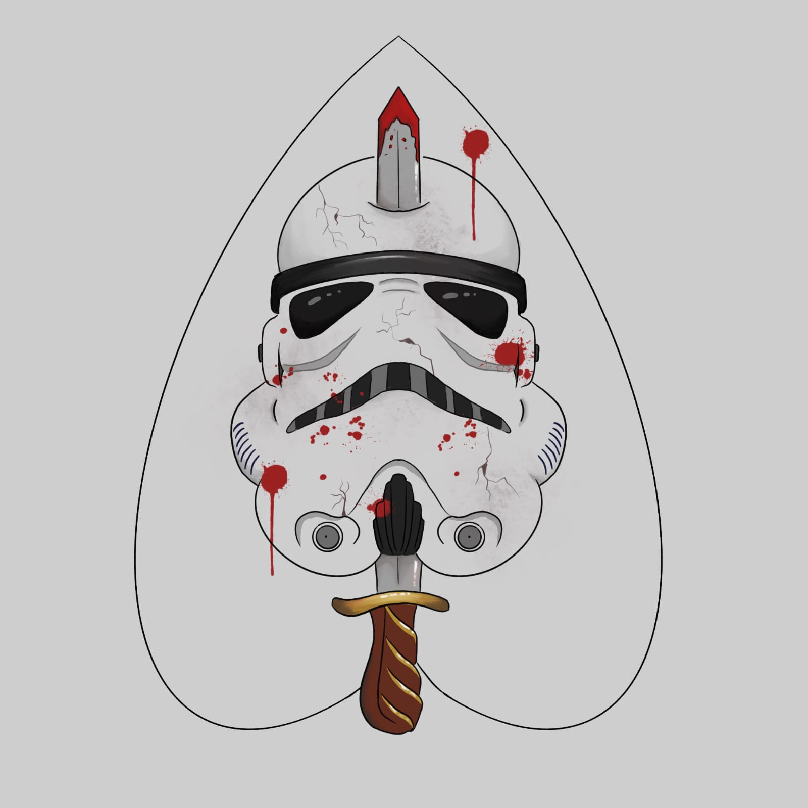

# História da Facção

Em uma trajetória de busca implacável por vingança pela sua família, Pyke tornou-se um caçador de recompensas conhecido e temido na galáxia de Calamum Caerulium. Alguns dos seus feitos através dessa jornada foram responsáveis por atrair a atenção do Comandante Estelar, sendo o principal deles a eliminação de uma unidade militar de Celestia e a morte de seu capitão Atrium.

Com isso, o Comandante Estelar percebeu uma grande oportunidade de recrutar Pyke para a liderança de uma de suas facções mais perigosas, efetivas e que seguiam o fortemente o lema de família. Portanto Pyke foi em busca da melhor equipe que a galáxia poderia criar, criando assim The Mandalorians.

Essa facção realiza os trabalhos mais difíceis e mais importantes sob o Comando Estelar, o que fez dela uma das maiores, mais temidas e mais importantes facções da galáxia.

