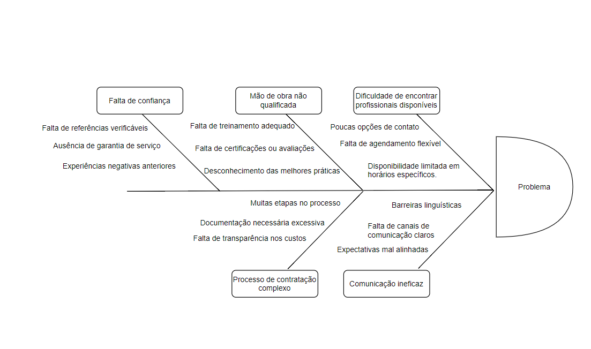

# Visão Geral do Produto

## 1.1 - Problema

O problema identificado é a dificuldade na contratação de prestadores de serviços domésticos, como limpeza, reparos, jardinagem, entre outros. Muitas vezes os clientes enfrentam desafios ao encontrar profissionais confiáveis, qualificados e disponíveis para realizar esses serviços de forma conveniente, além da barreira comunicativa existente entre contratante e contratado.

## 1.2 - Declaração de Posição do Produto

A nossa plataforma visa o mercado de serviços domésticos, oferecendo uma experiência única e abrangente tanto para prestadores de serviços quanto para clientes. Inspirado no modelo bem-sucedido do Uber e do Airbnb, o nosso produto permitirá que prestadores de serviços se cadastrem, sejam validados e comecem a trabalhar com facilidade e rapidez após aceitos.

O que nos diferencia dos concorrentes é a nossa ênfase na interatividade e na diversidade de serviços oferecidos. Além dos tradicionais serviços de limpeza, cuidados pessoais e jardinagem, estamos comprometidos em conectar nossos clientes a uma variedade de profissionais qualificados, incluindo cuidadores de idosos, cozinheiros, babás e reparadores domésticos.

A importância deste projeto é notável para todos os envolvidos. Para os proprietários de casas e usuários finais, oferecemos uma solução ágil para contratar serviços confiáveis, com comunicação e avaliação diretas entre empregadores e prestadores. Para os trabalhadores domésticos, proporcionamos uma oportunidade significativa de emprego, validação e crescimento profissional em um ambiente digital dinâmico.

Com este produto, queremos transformar a maneira como os serviços domésticos são acessados e entregues, promovendo eficiência, transparência e confiança em todas as interações.

## 1.3 - Objetivos do Produto

O objetivo principal do projeto HomeTasker é desenvolver e lançar uma plataforma digital inovadora que revoluciona a forma como clientes encontram e contratam prestadores de serviços domésticos confiáveis. Nossa plataforma oferecerá uma experiência conveniente e eficiente, oferecendo constante comunicação e avaliação entre as duas partes, além de permitir que os usuários encontrem uma variedade de serviços domésticos, desde limpeza e reparos até cuidados pessoais e jardinagem, com facilidade e segurança.

## 1.4 - Tecnologias a Serem Utilizadas

O site deverá ser implementado em TypeScript com o front-end realizado em React.js e back-end com Node.js(express.js). A base de dados será mantida no SGBD MySQL.
